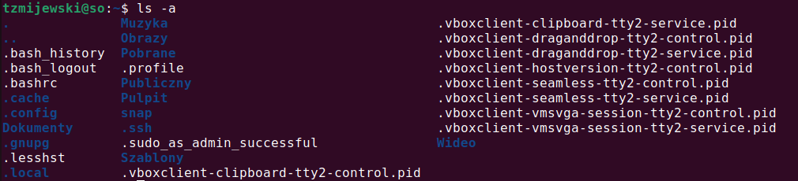

# Lab 1 - wprowadzenie do pracy w powłoce bash

Bash to powłoka systemowa, czyli program, który pośredniczy między użytkownikiem a komputerem i pozwala na "komunikację" z systemem operacyjnym poprzez komendy prezentując często wyniki działania na standardowym wyjściu -  domyślnie jest to okno konsoli, z której polecenia zostały wprowadzone. Jest to jedna z  najpopularniejszych powłok, stworzona dla projektu [GNU](https://pl.wikipedia.org/wiki/GNU) i jest jedną z najpopularniejszych powłok wśród systemów uniksowych, linuxowych. Dostępna również w niektórych wersjach systemu macOS.

> Nazwa jest akronimem od Bourne-Again Shell (angielska gra słów: fonetycznie brzmi tak samo, jak born again shell, czyli odrodzona powłoka).  
Patrz: [Wikipedia](https://pl.wikipedia.org/wiki/Bash)

## 1. Uruchamianie powłoki i podstawowe operacje na systemie plików

Jeżeli chcemy wywołać okno terminala z graficzmego interfejsu uzytkownika w systemie Ubuntu najwygodniejszym sposobem będzie użycie skrótu klawiaturowego `Ctrl + Alt + t`. W przypadku wersji 24.04 pobranej na zajęcia można też skorzystać z ikony w lewym dolnym rogu i wyświetlić programy (domyślnie często używane) i w górnej części wyszukać `terminal`. W przypadku połączenia poprzez terminal SSH (np. program PuTTy) jeżeli nasz użytkownik posiada domyślnie ustawioną powłokę jako bash, wystarczy że zalogujemy się naszymi poświadczeniami (login, hasło) i powłoka zostanie uruchomiona i będziemy mogli zdalnie wysyłac komendy do systemu. Proces podłączenia przez SSH będzie poruszony w późniejszym toku nauki.

System plików to zbiór katalogów i plików zorganizowanych w formie struktury drzewa. Istnieją pewne różnice w organizacji tej struktury w przypadku różnych systemów operacyjnych. Systemy plików w oprogramowaniu z rodziny Windows jest podzielony na voluminy oznaczone literami, gdzie każdy z nich stanowi oddzielną strukturę. Ścieżka `C:\programy\notepad.exe` oraz `D:\programy\notepad.exe` stanowią oddzielną strukturę, gdzie litera dysku to korzeń drzewa a kolejne foldery i pliki stanowią hierarchię. W systemach Linux jest tylko struktura, gdzie elementem nadrzędnym jest katalog główny `/` stanowiący element nadrzędny dla wszystkich innyc zasobów systemu plików. Nie oznacza to, że w systemach Linux możemy miec tylko jeden volumin lub system plików. Możemy jednocześnie podłączać wiele systemów plików, ale jeden system będzie głównym systemem a inne będą do niego montowane czyli umieszczane w istniejącej strukturze.

Przykladowa struktura katalogów w katalogu głównym systemu Linux:


Przeznaczenie kilku wybranych folderów systemu plików:
* **/bin** - katalog zawierający programy niezbędne do uruchomienia systemu;
* **/dev** - katalog zawierający pliki specjalne, które reprezentują dostępne urządzenia;
* **/etc** - katalog z lokalnymi plikami konfiguracyjnymi systemu;
* **/home** - w tym katalog znajdują się podkatalogi domowe użytkowników systemu;
* **/proc** - wirtualny system plików, który dostarcza informacji o bieżących procesach w systemie i jego jądrze;
* **/root** - zwyczajowo katalog domowy użytkownika `root`, czyli administratora systemu;
* **/usr** - katalog zawierający zestaw oprogramowania użytkowego dostępnego dla użytkowników;
* **/var** - katalog ten zawiera pliki, które często zmieniają swoją zawartość i/lub rozmiar.

Dokładny opis struktury dostępny jest w pomocy systemowej `man 7 hier`.

### 1.1 Korzystanie z pomocy systemowej

W systemach Unix dostępna jest pomoc systemowa w postaci dokumentów tekstowych opisujących różne aspekty systemu i jego narzędzia. Dostęp do dokumentacji możliwy jest dzięki przeglądarce interaktywnej, którą uruchamia się poleceniem:

Pomoc (manual) dla danego polecenia systemowego lub zagadnienia np. uprawnień (ang. permissions) można uzyskać również poprzez polecenia powłoki. To polecenie ma postać:

```console 
man nazwa_polecenia
```
gdzie nazwa_polecenia to nazwa programu lub usługi, dla której chce się uzyskać pomoc, np.:

```console
man passwd
```
pozwala na uzyskanie pomocy dla polecenia `passwd`. 

Strony dokumentacji podzielone są na sekcje, które separują informacje zawarte w pomocy - oto lista najpopularniejszych sekcji:

NAME - nazwa oraz krótki komentarz lub wyjaśnienie;  
SYNOPSIS - sposoby uruchamiania programu lub polecenia wraz z listą możliwych przełączników;  
DESCRIPTION - pełen opis programu oraz szczegółowy opis możliwych do zastosowania przełączników;  
CONFIGURATION - opis konfiguracji usługi lub programu;  
FILES - opis plików konfiguracyjnych;  
SEE ALSO - wskazówki dotyczące podobnych lub powiązanych poleceń.  

Całość dokumentacji podzielona jest na rozłączne rozdziały, które mogą się różnić w zależności od implementacji systemu, jednak najczęściej podział wygląda następująco:

rozdział nr 1 - polecenia użytkownika;  
rozdział nr 2 - wywołania systemowe;  
rozdział nr 3 - funkcje biblioteczne;  
rozdział nr 4 - pliki specjalne;  
rozdział nr 5 - formaty plików;  
rozdział nr 6 - gry;  
rozdział nr 7 - konwersje i rozmaitości;  
rozdział nr 8 - administracja i polecenia administratora;  
rozdział L - funkcje bibliotek matematycznych;  
rozdział N - funkcje tcl.  

Strony pomocy są oznaczane za pomocą hasła i numeru rozdziału, np.:

`passwd(1)`
oznacza, że dla polecenia użytkownika passwd pomoc systemowa znajduje się w rozdziale nr 1. Wskazanie konkretnego rozdziału pomocy możemy przywołać poprzez polecenie:

```console
man 1 passwd
```
Wyświetlona zostanie pomoc dla polecenia `passwd` z rozdziału nr 1.

Pomoc systemowa wyświetlana jest za pomocą przeglądarki more, którą obsługuje się za pomocą następujących poleceń klawiszowych:

spacja - następna strona,  
Ctrl+B - poprzednia strona,  
q - zamknięcie i opuszczenie manuala,  
/ - wyszukiwanie tekstu w przód, po znaku / wpisujemy tekst do wyszukania,  
? - wyszukiwanie tekstu w tył,  
n - przejście do następnego szukanego wystąpienia,  
N - przejście do poprzedniego szukanego wyrażenia.

Jeżeli nie znamy nazwy konkretnego narzędzia to możemy wyświetlić wszystkie dokumenty pomocy, które zawierają słowo kluczowe.

```console
tzmijewski@so-ubuntu:/$man -k search
apropos (1)          - search the manual page names and descriptions
apt-patterns (7)     - Syntax and semantics of apt search patterns
badblocks (8)        - search a device for bad blocks
bzegrep (1)          - search possibly bzip2 compressed files for a regular expression
bzfgrep (1)          - search possibly bzip2 compressed files for a regular expression
bzgrep (1)           - search possibly bzip2 compressed files for a regular expression
find (1)             - search for files in a directory hierarchy
lzegrep (1)          - search compressed files for a regular expression
lzfgrep (1)          - search compressed files for a regular expression
lzgrep (1)           - search compressed files for a regular expression
manpath (1)          - determine search path for manual pages
tracker-search (1)   - Search for content by type or across all types
xzegrep (1)          - search compressed files for a regular expression
xzfgrep (1)          - search compressed files for a regular expression
xzgrep (1)           - search compressed files for a regular expression
zegrep (1)           - search possibly compressed files for a regular expression
zfgrep (1)           - search possibly compressed files for a regular expression
zgrep (1)            - search possibly compressed files for a regular expression
zipgrep (1)          - search files in a ZIP archive for lines matching a pattern

```


Możliwe jest również użycie innych poleceń wyszukiwania pomocy systemowej:
```console
apropos passwd
whatis passwd
info passwd
```

W celu ułatwienia korzystania z pomocy oraz szerszego dostępu to pomocy polskojęzycznej w trakcie zajęć wykorzystana zostanie strona 
[https://manpages.ubuntu.com/manpages/noble/pl/](https://manpages.ubuntu.com/manpages/noble/pl/).


### 1.2 **Podstawowe operacje w systemie plików**

Podstawowa postać polecenia wygląda następująco:
```console
polecenie [przełączniki/opcje] [argumenty]
```

Przykład polecenia, dzięki któremu możemy wyświetlać zawartość wybranego obszaru systemu plików:

```console
ls -l /home
```

Powyższe wywołanie uruchomi polecenie `ls` (skrót od angielskiego słowa `list`) z opcją `-l` oraz argumentem `/home`. To konkretne wywołanie polecenia `ls` wyświetli rozszerzoną wersję widoku zawartości folderu `/home`, który zawiera foldery domowe wszystkich użytkowników poza użytkownikiem `root`.

Informacje o zasobach, które są wyświetlane poprzez opcję `-l` to rozpoczynając od lewej strony:
Pierwsza litera oznacza typ zasobu - „d” – folder (directory), „-” – oznacza plik. Mogą być też inne symbole np. gniazda (ang. socket).

Kolejne 9 znaków to uprawnienia:
- pierwsze 3 od lewej to uprawnienia dla użytkownika (ang. user, w skrócie `„u”`),
- kolejne 3 to uprawnienia dla grupy (ang. group, w skrócie `„g”`),
- ostatnie 3 to uprawnienia dla pozostałych (ang. others, w skrócie `„o”`).
Litery `rwx` oraz znak `-` w uprawnieniach oznaczają:  
`r` – prawo do odczytu (read),  
`w` – prawo do zapisu (write),  
`x` – prawo do wykonania (execute) w przypadku pliku; prawo do przeszukiwania w przypadku katalogu,  
`-` brak danego uprawnienia.
Kolejne kolumny to:
- ilość dowiązań twardych do danego zasobu,
- właściciel,
- grupa,
- rozmiar na dysku,
- data i czas ostatniej modyfikacji,
- nazwa zasobu.  
Zobacz również komendy `dir`, `vdir`.


Podstawowa postać polecenia `ls` bez żadnych argumentów oraz opcji wyświetla zawartość bieżącego folderu bez uwzględniania zasobów ukrytych. Po zalogowaniu się użytkownika folderem bieżącym jest zazwyczaj jego folder domowy jeżeli taki został utworzony. Informację o bieżącym folderze można sprawdzić poleceniem `pwd`, które jest akronimem angielskiego wyrażenia `print working directory`.  
Informacja o bieżącym folderze znajduje się również przed znakiem zachęty.

Rozpatrzmy poniższy przykładowy ciąg znaków w konsoli.

```console
tzmijewski@so-ubuntu:~$
```

Ciąg `tzmijewski@so-ubuntu` oznacza zalogowanego użytkownika `tzmijewski` na maszynie o nazwie `so-ubuntu`. Po znaku `:` znajduje się informacja o bieżącym folderze roboczym, przy czym `~` jest specjalnym aliasem oznaczającym folder domowy uużytkownika (można się upewnić wpisując polecenie `pwd`, które wyświetli pełną ścieżkę). Ostatni widoczny tutaj znak to znak zachęty (ang. command prompt). Jeśli efektywny UID (ang. user identifier, identyfikator użytkownika) jest 0 to znak `#`, w przeciwnym wypadku znak `$`.

Wygląd całego ciągu przed znakiem zachęty można zmieniać i jest on zapisany w zmiennej systemowej o nazwie `PS1` (de facto są jeszcze zmienne PS2, PS3 i PS4, które odpowiadają pozostałym 3 terminalom, pomiędzy którymi można się przełączać). Aby wyświetlić wartość zdefiniowanej już zmiennej musimy poprzedzić jej nazwę znakiem `$`.

Aby wyświetlić wartość tej zmiennej w konsoli wykorzystamy polecenie `echo`:

```console
tzmijewski@so-ubuntu:~$ echo $PS1
```

Efektem może być poniższy ciąg znaków:
```console
\[\e]0;\u@\h: \w\a\]${debian_chroot:+($debian_chroot)}\[\033[01;32m\]\u@\h\[\033[00m\]:\[\033[01;34m\]\w\[\033[00m\]\$
```

Wygląda dość skompikowanie i tajemniczo, ale każde zawarte w nim wyrażenie ma swoje wytłumaczenie. Poznanie szczegółów oraz sposoby zmiany wyświetlanych informacji pozostawiam czytelnikowi, który może się posiłkować artykułem zamieszczonym [tutaj](https://www.arturpyszczuk.pl/prompt.html).

Polecenie `ls` zawiera wiele przełączników, które pozwalają na osiąganie różnych efektów przy wyświetlaniu zawartości systemu plików a ich pełna lista dostępna jest w dokumentacji (`man ls`).

Aby jednym poleceniem przekazać więcej niż jeden przełącznik możemy to zrobić na kilka sposobów:

```console
ls -la
ls -l -a
la -l --all
```

Każde z tych trzech poleceń będzie miało dokładnie taki sam skutek. W pierwszym przypadku wykorzystano mechanizm łączenia opcji, co oznacza, że każda opcja w takim przypadku musi być jednoliterowa co można zaobserwować w drugim przypadku. Jeżeli jednak przełącznik/opcja wymaga parametru to wtedy łączenie ich nie zawsze jest możliwe. Zostanie to zaprezentowane na przykładzie polecenia `useradd`.

```console
useradd -m -s /bin/bash jkowalski
```

W tym przypadku polecenie useradd (poznamy je w dalszej części laboratorium) przyjmuje opcję `-m` a następnie `-s`, która jednak wymaga argumentu i tutaj jest nim `/bin/bash`. Ostatnia wartość to argument polecenia `useradd` - jkowalski - stanowiący nazwę tworzonego użytkownika.

Ostatni przykład, polecenie `ls -l --all` jest wykorzystaniem alternatywnego zapisu krótkiej opcji wersją długą, ze znakami `--` jednak istnienie takiej alternatywy należy potwierdzić w dokumentacji. Taka postać opcji może również przyjmować argumenty w postaci `--opcja=wartosc`. 


Wykonanie polecenia `ls` w zależności od wybranych opcji może rówież wyświetlać dwa symbole - `.` oraz `..`.



Te oznaczenia są aliasami, które ułatwiąją poruszanie się po strukturze systemu plików i są często wykorzystywane przez skrypty powłoki. Symbol `.` oznacza folder bieżący a `..` folder nadrzędny.
Dzięki temu nie musimy znać ich dokładnych nazw, żeby wykorzystać je w poleceniach.

### **Przechodzenie po strukturze folderów**

Aby zmienić bieżący folder na inny używamy polecenia `cd` (ang. change directory), które przyjmuje argument w postaci ścieżki do folderu. Ścieżka ta może być względna lub bezwzględna. Ścieżka względa oznacza drogę jaką musimy pokononać z bieżącego folderu do folderu docelowego. Np.:

```console
tzmijewski@so-ubuntu:/$cd etc
```
Powyższe polecenie zmieni folder bieżący z `/` na `/etc`. Ścieżka została podana jako ścieżka względna dlatego, że nie zawiera pełnej informacji od katalogu głównego (w systemach Windows od litery dysku) do miejsca docelowego. Oznacza to w tym przypadku, że przejdziemy do folderu `etc` pod warunkiem, że znajduje się on w bieżącym folderze.
Aby przejść do folderu `/etc` z dowolnego miejsca musimy podać ścieżkę bezwzględną, co oznacza, że bez względu na to, jaki jest aktualnie folder bieżący będziemy mogli zmienić go na folder docelowy.

```console
tzmijewski@so-ubuntu:/$cd /etc
```
Określając ścieżki możemy wykorzystać symbole (aliasy) `.` oraz `..`, np.:

```console
tzmijewski@so-ubuntu:/home/tzmijewski$cd ..
```
zmieni folder bieżący na folder `/home` czyli wykonaliśmy przejście o jeden poziom do góry jeżeli potraktujemy system plików jak odwrócone drzewo, gdzie korzeń to element nadrzędny. Ścieżki mogą być również bardziej złożone, np.:
```console
tzmijewski@so-ubuntu:/home/tzmijewski$cd ../..
```
przeniesie nas o dwa poziomy wyżej o ile to możliwe.

### **Tworzenie folderów i plików**

Polecenie `mkdir` (ang. make directory) pozwala na tworzenie folderów i struktur folderów.

`mkdir [przełączniki] nazwa_katalogu`  
np.:
`mkdir ./xyz` - utworzenie katalogu xyz w katalogu bieżącym;  
`mkdir ../xyz` - utworzenie katalogu xyz w katalogu bezpośrednio nadrzędnym.  

Odpowiednio `rmdir` służy do usuwania folderów lub ich struktur.  
`rmdir [przełączniki] nazwa_katalogu`  
`rmdir ~/xyz` - usunięcie katalogu xyz z katalogu domowego;  
`rmdir ./xyz` - usunięcie katalogu xyz z katalogu bieżącego.

Dla poleceń rmdir i mkdir dostępny jest przełącznik `-p`, który pozwala odpowiednio, usuwać i tworzyć struktury katalogów, np.:

`rmdir -p abc/def/ghi` - usunie katalogi ghi, def oraz abc, które tworzyły hierarchię.

> Korzystając z opcji `-p` należy zachować ostrożność, aby nie usunąć nieplanowanych zasobów.

Przydatnym przełącznikiem polecenia rm jest przełącznik -r, który służy do usuwania całych struktur katalogów.

`rm [przełączniki] lista_plików` - usuwanie plików podanych jako argumenty wywołania, np.:  
`rm abc.txt xyz.txt` - usuwa pliki abc.txt i xyz.txt w katalogu bieżącym;  
`rm /tmp/abc.txt` - usuwa plik abc.txt z katalogu /tmp;  


### **Kopiowanie i przenoszenie zasobów**

Plik to zdefiniowana (przeważnie przez użytkownika) porcja danych, która jest przechowywana w systemie w pamięci masowej. W systemach UNIX niemal wszystko jest plikiem, także urządzenia są reprezentowane przez specjalne pliki. Pozwala to, na zachowanie spójnego sposobu dostępu i obsługi do wielu heterogenicznych zasobów, w jeden transparentny sposób. Nazwy plików nie mają podziału na nazwę i rozszerzenie, jednakże można takie podejście stosować. Możliwe jest stosowanie w nazwach plików znaków specjalnych (np.: $, % lub #), ale nie jest to zalecane.

Podstawowe operacje obsługi plików można realizować z wykorzystaniem następujących poleceń:

`cp [przełączniki] nazwa_pliku nowa_nazwa_lub_katalog` - kopiowanie pliku określonego przez pierwszy argument pod nazwę lub do katalogu określonego drugim argumentem, np.:  
`cp abc.txt xyz.txt` - kopiuje plik abc.txt pod nową nazwę xyz.txt w katalogu bieżącym;  
`cp /tmp/abc.txt ~` - kopiuje plik abc.txt z katalogu /tmp do katalogu domowego użytkownika;  
`cp abc.txt ~/xyz.txt` - kopiuje plik abc.txt z katalogu bieżącego pod nową nazwę xyz.txt w katalogu domowym użytkownika.

Przydatnym przełącznikiem polecenia `cp` jest przełącznik `-r`, który służy do kopiowania całych struktur katalogów.

`cp -r folder1 folder2`

`touch [przełączniki] nazwa_pliku` - modyfikuje informacje na temat czasów modyfikacji i odczytu pliku, ale pozwala także na utworzenie pliku, np.:

`touch abc.txt` - utworzenie (pustego) pliku abc.txt w katalogu bieżącym.

`mv [przełączniki] nazwa_pliku nowa_nazwa` - zmiana nazwy pliku określonego pierwszym argumentem wywołania na nazwę określoną drugim argumentem wywołania. Jeśli drugi argument wywołania jest katalogiem, to wówczas plik zostanie przeniesiony do tego katalogu, np.:  
`mv abc.txt xyz.txt` - zmiana nazwy pliku abc.txt na nazwę xyz.txt w katalogu bieżącym;  
`mv /tmp/abc.txt ~` - przeniesienie pliku abc.txt z katalogu /tmp do katalogu domowego użytkownika.


Polecenia dotyczące plików (i katalogów) można także wydawać z wykorzystaniem tzw. wzorców uogólniających, które tworzy się z zastosowaniem następujących operatorów:

`*` - zastępuje dowolny ciąg znaków (także pusty);  
`?` - zastępuje dokładnie jeden dowolny znak;  
`[<znaki>]` - zastępuje dokładnie jeden znak z podanego zakresu, np.: [xyz];  
`[^<znaki>]` - znak `^` na początku oznacza dopełnienie zbioru, czyli dla przykładu [^xyz], oznacza dowolny znak nie będący literą x, y i z.
Oto przykładowe polecenia z wykorzystaniem wzorców uogólniających:

`cp ./*.txt ~` - kopiowanie wszystkich plików z rozszerzeniem .txt z katalogu bieżącego do katalogu domowego użytkownika;  
`rm ./[0-9]*` - usunięcie wszystkich plików z katalogu domowego, których nazwa rozpoczyna się od cyfry.

Pliki można również tworzyć, przeglądać i edytować za pomocą edytorów dostępnych z poziomu terminala. Oprócz dość nieintuicyjnego, ale kultowego edytora `vim`, warto sprawdzić możliwości prostego edytora `nano`.

### **Wyszukiwanie w systemie plików**

Zadanie to można zrealizować na kilka sposobów, w zależności od charakteru poszukiwanego pliku i kryteriów wyszukiwania.

Lokalizacji plików wykonywalnych - programów - można dokonać z wykorzystaniem polecenia:

`whereis [przełączniki] lista_programów`  
Wynikiem działania tego polecenia jest informacja o pełnej ścieżce do pliku oraz lokalizacja pliku z pomocą systemową dla wyszukiwanego programu - przykład:

```console
whereis ls
ls: /bin/ls /usr/share/man/man1/ls.1.gz
```
Do wyszukiwania plików można także zastosować polecenie:

`locate [przełączniki] wzorzec`  

Program ten wyszukuje pliki, podając listę plików ze śćieżkami, których nazwa zostanie dopasowana do podanego jako argument wywołania wzorca. Program locate zwraca wyniki niemal natychmiast, ponieważ wyszukiwanie faktycznie odbywa się na przygotowanej wcześniej bazie plików (nie jest przeszukiwana cała struktura katalogów). Baza ta (indeks nazw plików), przeważnie jest aktualizowana raz na dobę - oznacza to, że wynik może nie uwzględniać zmian w systemie plików i katalogów, jakie zostały wykonane po ostatniej aktualizacji spisu (aktualizacji może zawsze dokonać administrator systemu wykorzystując polecenie updatedb). Wzorzec zapytania można budować z wykorzystaniem operatorów uogólniających - wówczas należy umieścić wzorzec w cudzysłowie, aby nie został on rozwinięty przez interpreter poleceń; oto przykłady wywołań polecenia locate:

```console
locate ls
locate "*l*s"
locate "/usr/share/man/*ls.1.gz"
```


Faktyczne przeszukiwanie struktury katalogów systemu w poszukiwaniu plików (i katalogów) można zrealizować stosując polecenie:

`find katalog kryteria`

Pierwszym argumentem wywołania polecenia find jest nazwa katalogu, od którego ma się rozpocząć poszukiwanie; drugi argument dotyczy kryteriów jakie mają dotyczyć wyszukiwania. Specyfikacja kryteriów wyszukiwania to koniunkcja kryteriów, z których najczęściej używane to:

- `name <nazwa>` - pozycje o podanej nazwie (można także stosować operatory uogólniające) - rozróżniana jest jednak wielkość liter;
- `iname <nazwa>` - pozycje o podanej nazwie (można także stosować operatory uogólniające) - brak rozróżniania wielkości liter;
- `size <rozmiar><jednostka>` - pozycje o określonym rozmiarze - możliwe są następujące określenia jednostek: c - bajty, k - kilobajty, w - dwubajtowe słowa, brak jednostki oznacza 512-bajtowe bloki; przed rozmiarem można podać znaki + lub -, oznaczają one wówczas odpowiednio: pozycje o rozmiarze większym/mniejszym niż podany;
- `atime <dni>` - pozycje, na których była wykonywana jakaś operacja podaną liczbę dni temu; przed ilością dni można podać znaki + lub -, oznaczają one wówczas odpowiednio: pozycje, na których była wykonywana jakaś operacja więcej/mniej dni temu;
- `mtime <dni>` - pozycje, na które były modyfikowane podaną liczbę dni temu; przed ilością dni można podać znaki + lub -, oznaczają one wówczas odpowiednio: pozycje, na które były modyfikowane więcej/mniej dni temu;
- `ctime <dni>` - pozycje, których i-węzeł był modyfikowany podaną liczbę dni temu; przed ilością dni można podać znaki + lub -, oznaczają one wówczas odpowiednio: pozycje, których i-węzeł był modyfikowany więcej/mniej dni temu;
- `type <typ>` - określenie jakie pozycje mają zostać odnalezione: f - pliki zwykłe, d - katalogi, l - dowiązania symboliczne, c - urządzenia znakowe (niebuforowane), b - urządzenia blokowe (buforowane), p - kolejki FIFO;
- `exec <polecenie> [{}] \;` - wykonuje dowolne polecenie; polecenie może zostać wykonane na odszukanych pozycjach - wówczas należy zastosować jako argument polecenia znaki {}.

Oto przykłady użycia polecenia find:

`find ~ -name abc.txt` - wyszuka wszystkie pozycje o nazwie abc.txt, które znajdują sie w katalogu domowym użytkownika (oraz podkatalogach);  
`find ~/temp -name "*.txt"` - wyszuka wszystkie pozycje o nazwie z rozszerzeniem .txt, które znajdują sie w katalogu temp (oraz jego ewentualnych podkatalogach) w katalogu domowym użytkownika ;  
`find ~ -iname "*.txt" -type f -size +100k` - wyszuka wszystkie pliki zwykłe w katalogu domowym użytkownika (i jego podkatalogach), które mają rozszerzenie .txt - wielkość liter bez znaczenia - oraz rozmiar większy niż 100kB;  
`find /tmp -type f -atime +2 -exec rm {} \; -print` - wyszuka wszystkie pliki zwykłe w katalogu /tmp (oraz jego podkatalogach), na których nie były wykonywane żadne operacje w ciągu ostatnich 48 godzin oraz usunie wszystkie odnalezione pliki; dodatkowy przełącznik -print powoduje, że zostaną wyświetlone nazwy odnalezionych plików, pomimo wykonania na nich dodatkowej operacji (tutaj rm).

### **Inne przydatne polecenia powłoki** 

`who` - wyświetla aktualnie zalogowanych użytkowników w systemie,  
`id` - wyświetla informacje o identyfikatorze uzytkownika i grup, do których uzytkownik należy,  
`cat` - wyświetla zawartość plików podanych jako parametr wejściowy. 

Przykłady:  
`cat plik.txt` – wyświetli zawartość pliku plik.txt,  
`cat plik.txt plik2.txt` – wyświetli zawartość obu plików zgodnie z podaną kolejnością

`tac` - działa podobnie jak `cat`, do samodzielnego sprawdzenia.  
`wc` - liczy linie, słowa i znaki w pliku. Szczegóły do sprawdzenia w manualu polecenia.  
`grep` - narzędzie pozwalające przeszukiwać pliki, ciąg znaków w poszukiwaniu podanego wzorca.

Przykłady:  
`grep 'imie' plik.txt` – szuka tekstu ‘imie’ w pliku plik.txt  
`grep 'imie' *.txt` – szuka tekstu ‘imie’ we wszystkich plikach z rozszerzeniem .txt

W w/w przypadkach ‘imie’ jest argumentem, które może być wyrażeniem regularnym, które można zdefiniować w bardziej złożony sposób. 
Poniżej kilka możliwości:  
`.` – kropka zastępuje dowolny jeden znak tekstu  
`[abc]` – oznacza wstawienie dowolnego znaku spośród podanych – a,b lub c  
`[a-z]` – oznacza dowolny znak z zakresu a do z  
`[^]` – dopełnienie zbioru np.  
`[^aA]` – oznacza dowolny znak nie będący a lub A, natomiast  
`[^a-z]` - oznacza dowolny znak różny od a do z  
`^` – takie oznaczenie będzie znaczyło 'zaczyna się od', np.  
`^po` - oznacza zaczyna się od liter `po`.  
`$` – oznacza kończy się na, np. `ski$` - kończy się na `ski`.  
`\` - interpretuje kolejny znak dosłownie, np. '\.' szuka kropki zamiast dowolnego znaku  

Narzędzie `grep` posiada również kilka przydatnych opcji:  
`-i` – wzorzec NIE uwzględnia wielkości liter  
`-n` – dla każdego pliku zostanie też wyświetlony numer linii, w której został znaleziony wzorzec  
`-l` – wyświetli tylko nazwy plików, gdzie został znaleziony wzorzec  
`-v` – zaprzeczenie wzorca – wyświetli wszystkie linie, które NIE zawierają wzorca  
`-w` – wyszukuje nie fragment tekstu, a cały wyraz pasujący do wzorca  
Przykład:  
`grep -nwv 'hello' sam*` – wyświetli numer linii plików sam*, które nie zawierają w środku wyrazu ‚ hello’  
`head, tail` - polecenia pozwalają wyświetlić tylko wybraną ilość wierszy pliku z jego początku lub końca. Domyślnie wyświetlane jest do 10 linii, ale można to zmienić parametrem.

Przykład:  
`head -20 dlugi_plik.txt` – wyświetli pierwsze 20 linii pliku

### Przekierowanie standardowego wyjścia do pliku

Przekierowanie danych to inaczej wysłanie wyniku pracy komendy/polecenia do pliku (gniazda/drukarki). 
Rozpatrzmy poniższy przykład:
```console
$ ls > /home/tzmijewski/lista.txt
```
Wynik działania komendy ls zostanie przekierowany (symbolizuje to znak „>”) do w/w pliku, tzn., że lista która wyświetliłaby się na konsoli zostanie zapisana do pliku. Jeżeli plik nie istnieje to zostanie utworzony pod warunkiem posiadania odpowiednich uprawnień. Jeżeli plik istnieje to zostanie nadpisany nową zawartością.

Aby dopisać dane do pliku musimy zamienić znak „>” na „>>”, więc ponowne wywołanie
```console
$ ls >> /home/tzmijewski/lista.txt
```
spowoduje dopisanie danych do pliku lista.txt.

## **Ćwiczenia**


1. Przejdź do folderu domowego i wyświetl całą jego zawartość wraz z informacjami o uprawnieniach.
2. Wyświetl zawartość folderu `/var/log` posortowaną według rozmiaru (w wielkościach bardziej czytelnych dla człowieka – KB, MB itd.) rosnąco.
3. Za pomocą edytora nano zapisz do pliku imie.txt swoje imię.
4. Za pomocą komendy echo zapisz swoje nazwisko do pliku nazwisko.txt.
5. Za pomocą polecenia cat wyświetl zawartość obu plików.
6. Za pomocą polecenia cat dopisz do pliku imie.txt zawartość pliku nazwisko.txt.
7. Zapisz do pliku listę folderów ze swojego folderu domowego.
8. Przy pomocy narzędzia find wyszukaj wszystkie puste pliki w folderach domowych
użytkowników.
9. Przy pomocy narzędzia find wyszukaj wszystkie zwykłe pliki w swoim folderze domowym i zapisz wynik komendy do pliku ~/moje_pliki.txt.
10. Za pomocą find wyszukaj wszystkie pliki, których jesteś właścicielem.
11. Za pomocą find wyszukaj wszystkie pliki w folderze `~`, które zostały zmodyfikowane w ciągu ostatniego dnia.
12. Korzystając z programu find znajdź wszystkie pliki, które posiadają w nazwie słowo mozilla i znajdują się w podkatalogach katalogu /usr.
13. Korzystając z programu find znajdź wszystkie katalogi o nazwie bin, które znajdują się w katalogu /usr.
14. Za pomocą polecenia ls wyświetl tylko pliki z rozszerzeniem txt, które znajdują się w folderze domowym.
15. Wyświetl wszystkie zasoby z folderu /var/log, których nazwa rozpoczyna się od ‘a’ a na 3 pozycji znajduje się litera ‘t’.
16. Wyświetl 20 pierwszych linii pliku z ćwiczenia 9.
17. Wyświetl na konsoli liczbę wyrazów z pliku z zadania 7.
18. Ukryj plik nazwisko.txt korzystając z poznanych poleceń powłoki.
19. Zmień własne hasło.
20. Sprawdź własny identyfikator oraz grupy, do których należysz.
21. Sprawdź kto jest zalogowany w chwili obecnej w systemie.
22. Zapoznaj się z opisem struktury katalogów - polecenie `man 7 hier`. 
23. Wyświetl zawartość katalogu domowego.
24. Wyświetl zawartość podstawowych katalogów w systemie (np. /dev, /etc, /home, /usr).
25. Utwórz katalog kat1 w katalogu domowym.
26. W katalogu kat1 utwórz jednym poleceniem strukturę katalogów kat2/kat3/kat4.
27. Usuń jednym poleceniem całą strukturę katalogów kat3/kat4.
28. Utwórz w katalogu domowym pliki o dowolnych nazwach z rozszerzeniami .txt i .c.
29. Skopiuj jednym poleceniem wszystkie pliki z katalogu domowego z rozszerzeniem .txt do katalogu kat1.
30. Skopiuj jednym poleceniem wszystkie pliki z katalogu domowego z rozszerzeniem .c do katalogu kat2.
31. Skopiuj całą strukturę katalogów kat1 tworząc analogiczną strukturę o nazwie kat1b.
32. Usuń wszystkie plik z katalogu kat1/kat2.
33. Usuń jednym poleceniem całą strukturę katalogów kat1b.
34. Zmień nazwę dowolnego pliku w katalogu kat1.
35. Przenieś katalog kat1/kat2 do katalogu domowego tworząc w ten sposób katalog kat2b.
36. Przy pomocy programu locate znajdź wszystkie pozycje, które posiadają w nazwie słowo mozilla.
37. Przy pomocy programu locate znajdź wszystkie pozycje, które posiadają w nazwie słowo mozilla i znajdują się w podkatalogach katalogu /usr.
38. Skopiuj wszystkie pliki zwykłe o rozmiarze pomiędzy 10 a 100 bajtów z katalogu /usr/bin do katalogu kat1/kat2 (wykorzystaj polecenie find z parametrem -exec).
39. W katalogu domowym utwórz plik o nazwie plik.txt - sprawdź jakie są prawa dostępu do niego.
40. Przejrzyj pomoc systemową dla wszystkich poleceń zaprezentowanych podczas zajęć.
